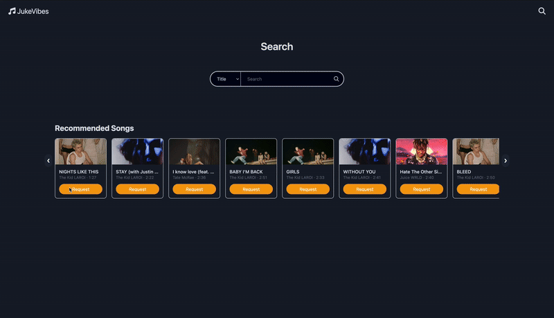
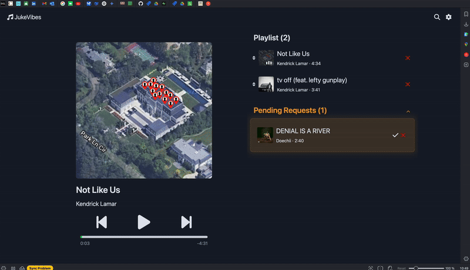

# JukeVibes

[![Contributors][contributors-shield]][contributors-url]
[![Forks][forks-shield]][forks-url]
[![Stargazers][stars-shield]][stars-url]
[![Issues][issues-shield]][issues-url]

<!-- PROJECT LOGO -->
<br />
<div align="center" >
  <a href="https://github.com/Saravia95/Group11-Capstone">
    
  </a>

<h3 align="center">JukeVibes</h3>

  <p align="center">
    Real-time Song Request Management System
  </p>
</div>

<!-- TABLE OF CONTENTS -->
<details>
  <summary>Table of Contents</summary>
  <ol>
    <li>
      <a href="#about-the-project">About The Project</a>
      <ul>
        <li><a href="#built-with">Built With</a></li>
      </ul>
    </li>
    <li>
      <a href="#getting-started">Getting Started</a>
      <ul>
        <li><a href="#prerequisites">Prerequisites</a></li>
        <li><a href="#installation">Installation</a></li>
      </ul>
    </li>
    <li><a href="#roadmap">Roadmap</a></li>
    <li><a href="#contact">Contact</a></li>
  </ol>
</details>

<!-- ABOUT THE PROJECT -->

## About The Project

<div align="center">
  
  <p><em>Users can search for songs and request them with a simple click of a button</em></p>
</div>

<div align="center">
  
  <p><em>Admins can approve or reject song requests and control playback</em></p>
</div>

### 🎧 Welcome to JukeVibes - Your Ultimate Song Request Platform!

- Experience seamless song request management with our real-time platform, designed to revolutionize how venues handle music requests! JukeVibes brings together customers and venue owners in perfect harmony.

### 🎼 Real-time Song Requests:

- Request your favorite songs instantly with our user-friendly interface. Instead of using physical jukeboxes, customers can easily request songs by scanning QR codes placed on their tables, making the experience more modern and convenient!

### 🎹 Smart Playlist Management:

- Venue owners can easily manage and organize song requests in real-time. Approve or reject requests with a single click, keeping your playlist fresh and engaging.

### 🎸 Spotify Integration:

- Seamlessly integrated with Spotify API, providing access to millions of songs and ensuring high-quality playback.

### 📱 Instant Updates:

- Experience real-time updates through WebSocket subscriptions. See your song requests move from pending to approved instantly!

### 👥 User Roles:

- Separate interfaces for customers and venue owners
- Easy-to-use admin dashboard for request management
- Customer-friendly request interface

### 🎯 Key Features:

- Real-time song request system
- Spotify API integration
- WebSocket-based live updates
- User authentication and authorization
- Responsive design for all devices

<p align="right">(<a href="#jukevibes">back to top</a>)</p>

### Built With

- [![React][React.js]][React-url]
- [![TypeScript][TypeScript]][TypeScript-url]
- [![Supabase][Supabase]][Supabase-url]
- [![Spotify][Spotify]][Spotify-url]

<p align="right">(<a href="#jukevibes">back to top</a>)</p>

<!-- GETTING STARTED -->

## Getting Started

### Prerequisites

- node
  - https://nodejs.org/en
- npm
  ```sh
  npm install npm@latest -g
  ```

### Installation

1. Clone the repo
   ```sh
   git clone https://github.com/Saravia95/Group11-Capstone.git
   ```
2. Install NPM packages
   ```sh
   npm install
   ```
3. Copy the `.env.example` file with the name `.env`
   ```sh
   cp .env.example .env
   ```
4. Setup Environment Variables
   1. `SUPABASE_URL`: Your Supabase project URL
   2. `SUPABASE_ANON_KEY`: Your Supabase anonymous key
   3. `SPOTIFY_CLIENT_ID`: Your Spotify API client ID
   4. `SPOTIFY_CLIENT_SECRET`: Your Spotify API client secret
   5. `CLIENT_URL`: Your frontend URL (e.g., http://localhost:3000)

### Run Application Locally

1. Run the Application
   ```sh
   npm run dev
   ```
2. Open [http://localhost:3000](http://localhost:3000) with your browser

<p align="right">(<a href="#jukevibes">back to top</a>)</p>

<!-- ROADMAP -->

## Roadmap

- [x] User Authentication
- [x] Real-time Song Requests
- [x] Spotify Integration
- [x] Admin Dashboard
- [x] Request Management
- [x] Real-time Updates
- [ ] Playlist History
- [ ] Analytics Dashboard
- [ ] Mobile App

<p align="right">(<a href="#jukevibes">back to top</a>)</p>

<!-- CONTACT -->

## Contact

**Jonathan Saravia**

- :briefcase: LinkedIn: [https://linkedin.com/in/jonathan-saravia](https://www.linkedin.com/in/jonathansaravia95/)
- :school_satchel: Website: https://saraviaportfolio.netlify.app
- :mailbox: Email: jonathan.saravia@hotmail.ca

**Hyunchul Cho**

- :briefcase: LinkedIn: [https://www.linkedin.com/in/hyunchul-cho/](https://www.linkedin.com/in/hyunchul-cho-497037216/)
- :school_satchel: Website: https://hc-blog-mu.vercel.app
- :mailbox: Email: chc3954@gmail.com

**Gayoung Kim**

- :briefcase: LinkedIn: [https://linkedin.com/in/gyoung-kim](https://www.linkedin.com/in/gayoung-k/)
- :school_satchel: Website: https://gk-blog-kappa.vercel.app/
- :mailbox: Email: gykim8798@gmail.com

**Joseph Omali**

- :briefcase: LinkedIn: https://www.linkedin.com/in/joseph-omali-822184323
- :mailbox: Email: joseph_omali@outlook.com

**John Michalsky**

- :briefcase: LinkedIn: https://www.linkedin.com/in/jmichalsky/
- :mailbox: Email: jrmichalsky@live.ca

Project Link: [https://github.com/Saravia95/Group11-Capstone](https://github.com/Saravia95/Group11-Capstone)

<p align="right">(<a href="#jukevibes">back to top</a>)</p>

<!-- MARKDOWN LINKS & IMAGES -->

[contributors-shield]: https://img.shields.io/github/contributors/Saravia95/Group11-Capstone.svg?style=for-the-badge
[contributors-url]: https://github.com/Saravia95/Group11-Capstone/graphs/contributors
[forks-shield]: https://img.shields.io/github/forks/Saravia95/Group11-Capstone.svg?style=for-the-badge
[forks-url]: https://github.com/Saravia95/Group11-Capstone/network/members
[stars-shield]: https://img.shields.io/github/stars/Saravia95/Group11-Capstone.svg?style=for-the-badge
[stars-url]: https://github.com/Saravia95/Group11-Capstone/stargazers
[issues-shield]: https://img.shields.io/github/issues/Saravia95/Group11-Capstone.svg?style=for-the-badge
[issues-url]: https://github.com/Saravia95/Group11-Capstone/issues
[license-shield]: https://img.shields.io/github/license/Saravia95/Group11-Capstone.svg?style=for-the-badge
[license-url]: https://github.com/Saravia95/Group11-Capstone/blob/master/LICENSE.txt
[linkedin-shield]: https://img.shields.io/badge/-LinkedIn-black.svg?style=for-the-badge&logo=linkedin&colorB=555
[linkedin-url]: https://linkedin.com/in/your-linkedin
[React.js]: https://img.shields.io/badge/React-20232A?style=for-the-badge&logo=react&logoColor=61DAFB
[React-url]: https://reactjs.org/
[TypeScript]: https://img.shields.io/badge/TypeScript-007ACC?style=for-the-badge&logo=typescript&logoColor=white
[TypeScript-url]: https://www.typescriptlang.org/
[Supabase]: https://img.shields.io/badge/Supabase-3ECF8E?style=for-the-badge&logo=supabase&logoColor=white
[Supabase-url]: https://supabase.com/
[Spotify]: https://img.shields.io/badge/Spotify-1DB954?style=for-the-badge&logo=spotify&logoColor=white
[Spotify-url]: https://www.spotify.com/
[user-demo]: ./readme_images/demo_user.gif
[admin-demo]: ./readme_images/demo_admin.gif
